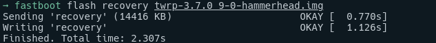

# Setup NetHunter on Nexus5

How to Setup Kali NetHunter for Nexus5.

Nexus5 can use Nexmon for the some wifi tools.  
I Would try to use it next Wifi penetration test engagement.

## Summary

1. Enable developer mode on Android
2. Enable USB debug at developer mode
3. Connect PC and OEM Unlock in bootloader by `fastboot oem unlock` commands
4. Install Latest TWRP `fastboot flash recovery twrp-3.7.0_9-0-hammerheadcaf.img`
5. Download Android 6 (marshmallow) image of Nexus 5 
6. Install OS to Nexus 5
7. Download and install Magisk Manager from Magisk github repo using Web browser of Nexus5 
8. Download Magisk.apk by PC also and change its file name as Magisk.zip from apk
9. Copy it to Android by `adb push` command in TWRP
10. Install Magisk.zip
11. Restart OS and reinstall Magisk by Magisk manager app to be true root.
12. Build nethunter image by kali official resource (Don't use `-fs full`, it makes updater error, I used nano. /system space is not enough for minimal)
13. Copy built nethunter image and install it from TWRP
14. Install Kali Chroot Manager  (Choose kalifs-armhf-minimal.tar.xz)
    - Downlaod from https://build.nethunter.com/kalifs/kalifs-latest/
    - install from NetHunter App
    - Directory is 
15. select kali-armhf as chroot
16. update from NetHunter app

## References

- https://gist.github.com/jmingov/4fd6d02ae75cdedd62144623725ef6e6
- https://pwnieexpres.com/blogs/news/a-simple-guide-to-installing-nethunter-on-a-nexus-5x
- https://www.getdroidtips.com/install-official-twrp-recovery-for-nexus-5/


## Memo

Some app not working...  
Aircruck-ng is work.

<br>

# The following content is currently under construction.


## Setup Flow

### 1. Enable Develper Mode

On Nexus5
1. Settings -> About 
2. Tapping on Build number field 7 times

### 2. Unlocking

#### a. Download ADB and fastboot (depends on OS/distro)

Just unzip on Linux

- ADB: https://developer.android.com/tools/releases/platform-tools
- Reference: https://www.xda-developers.com/install-adb-windows-macos-linux/#how-to-set-up-adb-on-your-computer


#### b. Enable USB debugging in the developer options and connect computer
Reference: https://source.android.com/docs/setup/test/running

After enable USB debugging mode, check connection.

```sh
lsusb
```


And check connection between adb and android

```sh
adb devices
```


If you need full backup without system data as an apk 
```sh
adb backup -apk -noshared -all -nosystem -f full_backup.ab 
```

#### c. Put phone into fastboot by holding down vol down + power
Reference: https://source.android.com/docs/setup/build/running?hl=ja


#### d. Unlocking OEM (Bootloader)

```sh
fastboot oem unlock
```


    

### 4. Installing TWRP for recovery

#### About: TWRP

Reference: https://twrp.me/lg/lgnexus5.html

TWRP (Team Win Recovery Project) is a custom recovery that allows you to install custom ROMs and modifications on your Android device.

#### Install TWRP

When Android device is fastboot mode and OEM was unlocked. An img can be flashed to device by following Command.

```
fastboot flash recovery twrp-3.7.0_9-0-hammerheadcaf.img
```




### 5. Lunch TWRP entering recovery mode

After flashing TWRP, Enter Recovery Mode

fastboot mode -> Recovery 

### 6. Wipe and format strage for the mount

Even strage was not able to be mounted. following steps are good for restore. 

Reference: https://droidwin.com/failed-to-mount-data-invalid-argument-in-twrp-fix/

#### STEP 1: Repair Data Partition via TWRP

a. Wipe > Advanced Wipe > Repair or Change File System

b. Repair File System > Swipte to Repair.

#### STEP 2: Change the File System

a. Wipe > Advanced Wipe  
b. Sllect "Data" and tap Repair File system  
c. Chage file System and choose exFAT  
d. After finished it Change file system to ext4  
e. Wipe > Format Data > enter YES  

After wiping and re-format ext4fs. Internal Strage of Nexus5 will apear.


### 7. Install Android 6 from Factory Image

We wiped OS image, so need re-install OS from factory image.

#### a. reboot to bootloader

Flash script has some fastboot commands. so need to enter bootloader mode.

#### b. Run the script to install Android 6 OS

Factory Image: https://developers.google.com/android/images#hammerhead

Unzip downloaded zip > run flash-all.sh


### 7. Install Magisk

Install Magisk to install into Android 6 OS.

#### a. Downlaod and install Magisk apk by browser of Android

Need to allow to install downloaded apk.

Reference: https://github.com/topjohnwu/Magisk/

> Note: Magisk.apk can be Magisk Manager and Magisk

#### b. Download Magisk apk

1. Change filename Magisk-v27.0.apk -> Magisk-v27.0.zip
2. `adb push Magisk-v27.0.zip /sdcard` and Install Magisk from TWRP


### 8. Build NetHunter Image

Offsec is releasing NetHunter OS for nought (Android 7).  
Nexus5 accepts only Android 6 (mashmallow).

I would not compile lingearOS for it, so I tried to build NetHunter image for mashmallow using official compile kit.

Reference: https://www.kali.org/docs/nethunter/building-nethunter/

```sh
./bootstrap.sh

python3 build.py -d hammerhead --marshmallow -fs nano
```

> Note: NetHunter.apk's hash was not match. so I had over written it. It's risky, I have to notice it maintainer. 


### 9. Install NetHunter

from TWRP.

Install > select Nethunter image


<br>

## Recovery

If you crash OS, You can restart from the factory image.

Factory Image: https://developers.google.com/android/images#hammerhead

Unzip > run flash-all.sh
