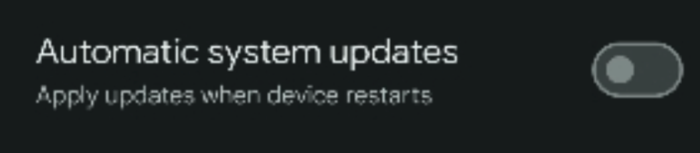
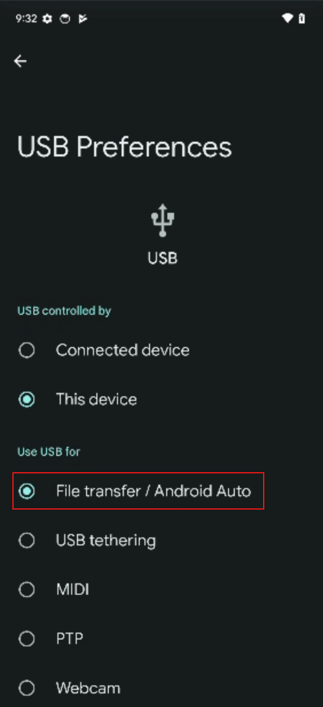

# Rooted Pixel 6a by Magisk

## Disclaimer
This project is intended for educational and research purposes only. The use of this information for any illegal activities is strictly prohibited. The authors are not responsible for any misuse of the information provided in this repository.

## 1. Developer options

Enable "Stay awake"

  

Disable "Automatic system updates"

  

Enable USB debugging 

  

## 2. Settings > Connected devices > USB

Select "File transfer / Android Auto"

  

 

## 3. TBC

xxxx

## Referenced

- https://www.hexordia.com/blog-1-1/unlock-rooting-pixel6a
- https://mitanyan98.hatenablog.com/entry/2022/07/29/030633

